# API and Dependencies — Sparks Design System (Radix UI)

Generated: 2026-05-20

---

## Component APIs

### Button

**Import**: `import { Button, buttonVariants } from "@/components/ui/button"`

**Props**:

| Prop | Type | Default | Figma Property | Description |
|---|---|---|---|---|
| `variant` | `"primary" \| "secondary" \| "tertiary" \| "utility" \| "destructive"` | `"primary"` | Variant | Visual style; maps to component token class |
| `size` | `"sm" \| "md" \| "lg"` | `"md"` | Size | Height/padding/font size |
| `loading` | `boolean` | `false` | State = Loading | Shows loading indicator; disables interaction |
| `leadingIcon` | `React.ReactNode` | — | Has Leading Icon | Icon rendered before label |
| `trailingIcon` | `React.ReactNode` | — | Has Trailing Icon | Icon rendered after label |
| `asChild` | `boolean` | `false` | — | Renders as child element via Radix Slot |
| `disabled` | `boolean` | `false` | State = Disabled | Native disabled; maps to CSS :disabled / [data-disabled] |
| `className` | `string` | — | — | Additional classes merged via cn() |
| `children` | `React.ReactNode` | — | Label | Button text content |
| `ref` | `React.Ref<HTMLButtonElement>` | — | — | Forwarded ref |

**Exported**: `Button`, `buttonVariants` (CVA function for external variant extension)

**Radix primitive**: `@radix-ui/react-slot` (Slot — for asChild)

**Token file**: `src/tokens/components/button.css`

**CSS class rules**: `src/components/ui/button/button.css`
- Classes: `.button-primary`, `.button-secondary`, `.button-tertiary`, `.button-utility`, `.button-destructive`
- State selectors: `:hover`, `:active`, `:disabled`, `[data-disabled]`, `[data-loading]`
- Size classes: `.button-size-sm`, `.button-size-md`, `.button-size-lg`

---

### Calendar

**Import**: `import { Calendar } from "@/components/ui/calendar"`

**Props**:

| Prop | Type | Default | Description |
|---|---|---|---|
| `selected` | `Date \| undefined` | — | The currently selected date (controlled) |
| `onSelect` | `(date: Date \| undefined) => void` | — | Callback when a day is clicked |
| `defaultMonth` | `Date` | current month | Month shown on initial render |
| `disabled` | `Matcher \| Matcher[]` | — | Days to disable (e.g. `{ before: new Date() }`, `{ dayOfWeek: [0,6] }`) |
| `numberOfMonths` | `number` | `1` | Months displayed side by side |
| `showOutsideDays` | `boolean` | `true` | Show days from adjacent months |
| `className` | `string` | — | Additional classes merged onto the DayPicker root |
| `ref` | `React.Ref<HTMLDivElement>` | — | Forwarded to a thin wrapper div (DayPicker v10 does not accept a ref) |

**Exported**: `Calendar`, `CalendarProps`

**Radix primitive**: None. Wraps `react-day-picker` v10 (DayPicker) for all interaction and accessibility.

**Key DayPicker settings**: `mode="single"`, `navLayout="around"` (nav buttons absolutely positioned flanking the month label), `showOutsideDays`.

**Token file**: `src/tokens/components/calendar.css` (41 tokens)

**CSS class rules**: `src/components/ui/calendar/calendar.css`
- Root: `.calendar-root` (background, border, radius, padding)
- Month structure: `.calendar-month`, `.calendar-month-caption`, `.calendar-caption-label`
- Nav buttons: `.calendar-nav-button`, `.calendar-nav-button--prev`, `.calendar-nav-button--next`
- Grid: `.calendar-month-grid`, `.calendar-weekday`, `.calendar-day`, `.calendar-day-button`
- Day state selectors: `.calendar-day.calendar-day--{modifier} .calendar-day-button` (selected, today, outside, disabled, focused)
- Nav disabled: `[aria-disabled="true"]` (react-day-picker uses aria-disabled, not native disabled)

---

### Card

**Import**: `import { Card, CardImage, CardContent, CardHeader, CardTitle, CardSubtitle, CardDescription, CardFooter } from "@/components/ui/card"`

**Card (root)**:

| Prop | Type | Default | Description |
|---|---|---|---|
| `className` | `string` | — | Additional classes merged via cn() |
| `children` | `React.ReactNode` | — | Card content (sub-parts) |
| `ref` | `React.Ref<HTMLDivElement>` | — | Forwarded ref |

**CardImage**:

| Prop | Type | Description |
|---|---|---|
| `children` | `React.ReactNode` | Image slot content (typically an ``) |
| `className` | `string` | — |

**CardContent, CardHeader, CardFooter**: Standard div wrappers with token-driven padding/gap; accept `className` and `children`.

**CardTitle, CardSubtitle, CardDescription**: Semantic text elements (`<h3>`, `<p>`) with text-style token classes applied; accept `className` and `children`.

**Radix primitive**: None (layout-only component)

**Token file**: `src/tokens/components/card.css`

**CSS class rules**: `src/components/ui/card/card.css`

---

### Combobox

**Import**: `import { Combobox } from "@/components/ui/combobox"`

**Notes**: Uses `@radix-ui/react-popover` with `Popover.Anchor` pattern (not `Popover.Trigger`). The input controls open state directly. Special handling required for `onPointerDownOutside` and `onFocusOutside` to prevent the popover closing when the user interacts with the anchor input.

**Radix primitive**: `@radix-ui/react-popover`

**CSS class rules**: No dedicated .css file — styles may be embedded in the component or rely on component tokens. Follow-up needed.

---

### Dropdown Menu

**Import**: `import { DropdownMenu, ... } from "@/components/ui/dropdown-menu"`

**Notes**: Full Radix DropdownMenu wrapper. Exports Root, Trigger, Content, Item, Separator, and other sub-parts as a compound component.

**Radix primitive**: `@radix-ui/react-dropdown-menu`

**Token file**: `src/tokens/components/dropdown-menu.css`

**CSS class rules**: `src/components/ui/dropdown-menu/dropdown-menu.css`

---

### DataTable

**Import**: `import { DataTable } from "@/components/ui/data-table"`

**Origin**: Layout component — no Radix primitive, native `<table>` with ARIA

**Compound API**:

| Sub-component | Element | Key props |
|---|---|---|
| `DataTable` | `<div>` wrapper + `<table>` | `className` |
| `DataTable.Header` | `<thead>` | standard thead props |
| `DataTable.Body` | `<tbody>` | standard tbody props |
| `DataTable.Row` | `<tr>` | `selected`, `onSelect` |
| `DataTable.HeaderCell` | `<th>` | `sortDirection`, `onSort` |
| `DataTable.Cell` | `<td>` | `muted` |
| `DataTable.CheckCell` | `<td>` or `<th>` | `checked`, `indeterminate`, `onCheckedChange`, `asHeader` |
| `DataTable.StatusBadge` | `<span>` | `status: "active" \| "pending" \| "archived"` |
| `DataTable.ActionButton` | `<button>` | `icon` |
| `DataTable.EmptyState` | `<tr>` | `colSpan`, `message`, `icon` |

**DataTable.Row props**:

| Prop | Type | Default | Description |
|---|---|---|---|
| `selected` | `boolean` | — | Marks row as selected; applies `data-selected` attribute and selected background token |
| `onSelect` | `(selected: boolean) => void` | — | Called when row is clicked or Space/Enter pressed; makes row focusable |

**DataTable.HeaderCell props**:

| Prop | Type | Default | Description |
|---|---|---|---|
| `sortDirection` | `"asc" \| "desc" \| null` | — | Current sort direction; controls active triangle colour in sort icon |
| `onSort` | `() => void` | — | Called on header click; makes header sortable (adds cursor-pointer, aria-sort) |

**DataTable.CheckCell props**:

| Prop | Type | Default | Description |
|---|---|---|---|
| `checked` | `boolean` | `false` | Checkbox checked state |
| `indeterminate` | `boolean` | — | Indeterminate state (partial selection) — set via DOM ref |
| `onCheckedChange` | `(checked: boolean) => void` | — | Checkbox change handler; click is stopPropagated to prevent row double-toggle |
| `asHeader` | `boolean` | `false` | Renders as `<th scope="col">` instead of `<td>` |

**DataTable.StatusBadge props**:

| Prop | Type | Default | Description |
|---|---|---|---|
| `status` | `"active" \| "pending" \| "archived"` | — | Badge variant; controls background, foreground, and border tokens |
| `children` | `React.ReactNode` | status capitalised | Label text; defaults to "Active" / "Pending" / "Archived" |

**Row selection pattern** (controlled by consumer):

```tsx
const [selectedRows, setSelectedRows] = React.useState<string[]>([])
const toggle = (id: string) =>
  setSelectedRows(prev => prev.includes(id) ? prev.filter(r => r !== id) : [...prev, id])

<DataTable.Row selected={selectedRows.includes(row.id)} onSelect={() => toggle(row.id)}>
  <DataTable.CheckCell checked={selectedRows.includes(row.id)} onCheckedChange={() => toggle(row.id)} />
```

**Token file**: `src/tokens/components/data-table.css` (44 tokens)

**CSS class rules**: `src/components/ui/data-table/data-table.css`

**Architecture notes**:
- No CVA — table has a single visual treatment; no variant axis
- Row states (hover, selected, selected+hover, focus) handled via CSS pseudo-classes and `data-selected` attribute
- Sorting is visual-only — the component renders sort icons and fires `onSort`, but does not sort data
- CheckCell checkbox is temporary — will be replaced with the Checkbox component when built; `onClick` stopPropagation prevents double-toggle with row click handler
- `color/transparent` primitive must be `oklch(0 0 0 / 0)` (not white) for dark mode row backgrounds to work correctly

---

## Internal APIs

### cn() Utility

**Location**: `src/lib/utils.ts`

**Signature**: `cn(...inputs: ClassValue[]): string`

**Purpose**: Merges class names using clsx for conditional logic and tailwind-merge to deduplicate conflicting Tailwind classes. Used in every component's `className` merge.

---

### sync-token-imports.mjs

**Location**: `scripts/sync-token-imports.mjs`

**Invocation**: `npm run sync-tokens` (also runs as `predev`, `prebuild`, `prestorybook`)

**Behaviour**:
1. Scans `src/tokens/` recursively for all `.css` files
2. Generates `src/tokens/index.css` with `@import` statements in depth-first alphabetical order
3. Appends a `:root {}` block to correct font-family names for `@fontsource-variable` packages

**FONT_FAMILY_MAP** (must be kept in sync with installed packages):

| Figma Name | CSS Name |
|---|---|
| `"Inter"` | `"'Inter Variable', sans-serif"` |
| `"Playfair Display"` | `"'Playfair Display Variable', serif"` |
| `"Roboto Mono"` | `"'Roboto Mono Variable', monospace"` |

**Output**: `src/tokens/index.css` — do not edit manually.

---

## Data Models

### Token Naming Contract

Figma variable names map 1:1 to CSS custom property names via slash-to-hyphen conversion:

```
Figma variable path               CSS custom property
---------------------------------  ----------------------------------
button/color/primary/background    --button-color-primary-background
button/color/primary/hover/bg      --button-color-primary-hover-background
button/radius                      --button-radius
card/image/height                  --card-image-height
```

This contract makes Figma exports drop-in replaceable — only the `:root {}` variable values change; the class rules that consume them never need updating.

### Semantic Colour Token Categories

Defined in `src/tokens/semantic-colours.css` (plus dark mode overrides in `src/index.css`):

| Category | Pattern | Examples |
|---|---|---|
| Background | `--background-{type}` | `--background-default`, `--background-subtle`, `--background-inverse` |
| Foreground | `--foreground-{type}` | `--foreground-default`, `--foreground-muted`, `--foreground-inverse` |
| Border | `--border-{type}` | `--border-default`, `--border-subtle`, `--border-strong` |
| Accent | `--color-accent-*` | `--color-accent`, `--color-accent-hover`, `--color-accent-foreground` |
| Destructive | `--color-destructive-*` | `--color-destructive`, `--color-destructive-hover` |
| Text states | `--color-text-*` | `--color-text-disabled` |

### Semantic Spacing and Sizing Tokens

Defined in `src/tokens/semantic-spacing-&-sizing.css`:

| Category | Pattern | Examples |
|---|---|---|
| Control heights | `--size-control-{scale}` | `--size-control-sm`, `--size-control-md`, `--size-control-lg` |
| Radii | `--radius-{scale}` | `--radius-control`, `--radius-card` |
| Border widths | `--border-width-{type}` | `--border-width-none`, `--border-width-hairline`, `--border-width-default`, `--border-width-thick` |
| Touch targets | `--size-touch-target-*` | `--size-touch-target-min` |

### Semantic Typography Tokens

Defined in `src/tokens/semantic-typography.css`:

| Category | Pattern |
|---|---|
| Font family | `--font-family-{name}` |
| Font size | `--font-size-{scale}` |
| Font weight | `--font-weight-{name}` |
| Line height | `--line-height-{scale}` |
| Letter spacing | `--letter-spacing-{scale}` |

### Primitive Colour Palette

Defined in `src/tokens/primitives.css` using `oklch()` values:

| Colour Family | Shades Available |
|---|---|
| steel-grey | 50, 100, 200, 300, 400, 500, 600, 700, 800, 900, 950 |
| arctic-blue | 50, 100, 200, 300, 400, 500, 600, 700, 800, 900, 950 |
| cerulean | 50, 100, 200, 300, 400, 500, 600, 700, 800, 900, 950 |
| amber-gold | 50, 100, 200, 300, 400, 500, 600, 700, 800, 900, 950 |
| evergreen | 50, 100, 200, 300, 400, 500, 600, 700, 800, 900, 950 |
| crimson-rose | 50, 100, 200, 300, 400, 500, 600, 700, 800, 900, 950 |

---

## Internal Dependencies

```mermaid
graph TD
    IndexCSS["src/tokens/index.css\n(auto-generated)"]
    PrimCSS["primitives.css"]
    SemColorCSS["semantic-colours.css"]
    SemEffectCSS["semantic-effects.css"]
    SemEffStyleCSS["semantic-effect-styles.css"]
    SemSpaceCSS["semantic-spacing-&-sizing.css"]
    SemTextStyleCSS["semantic-text-styles.css"]
    SemTypoCSS["semantic-typography.css"]
    CompBtnCSS["components/button.css"]
    CompCardCSS["components/card.css"]
    CompDDCSS["components/dropdown-menu.css"]
    CompTICSS["components/text-input.css"]
    AppCSS["src/index.css"]
    Utils["src/lib/utils.ts"]
    BtnTSX["button/button.tsx"]
    CardTSX["card/card.tsx"]
    CbxTSX["combobox/combobox.tsx"]
    DDTsX["dropdown-menu/dropdown-menu.tsx"]

    PrimCSS --> IndexCSS
    SemColorCSS --> IndexCSS
    SemEffectCSS --> IndexCSS
    SemEffStyleCSS --> IndexCSS
    SemSpaceCSS --> IndexCSS
    SemTextStyleCSS --> IndexCSS
    SemTypoCSS --> IndexCSS
    CompBtnCSS --> IndexCSS
    CompCardCSS --> IndexCSS
    CompDDCSS --> IndexCSS
    CompTICSS --> IndexCSS
    IndexCSS --> AppCSS
    Utils --> BtnTSX
    Utils --> CardTSX
    Utils --> CbxTSX
    Utils --> DDTsX
```



---

## External Dependencies

### Production Dependencies

| Package | Version | Purpose | License |
|---|---|---|---|
| react | ^19.2.0 | UI component runtime | MIT |
| react-dom | ^19.2.0 | DOM renderer | MIT |
| @radix-ui/react-slot | ^1.1.2 | Polymorphic asChild rendering | MIT |
| @radix-ui/react-dropdown-menu | ^2.1.4 | Dropdown menu primitive | MIT |
| @radix-ui/react-popover | ^1.1.4 | Popover primitive (used by Combobox) | MIT |
| @radix-ui/react-dialog | ^1.1.4 | Modal dialog primitive | MIT |
| @radix-ui/react-select | ^2.1.4 | Select primitive | MIT |
| @radix-ui/react-checkbox | ^1.1.4 | Checkbox primitive | MIT |
| @radix-ui/react-radio-group | ^1.2.3 | Radio group primitive | MIT |
| @radix-ui/react-switch | ^1.1.3 | Switch/toggle primitive | MIT |
| @radix-ui/react-tabs | ^1.1.3 | Tabs primitive | MIT |
| @radix-ui/react-toast | ^1.2.4 | Toast notification primitive | MIT |
| @radix-ui/react-tooltip | ^1.1.6 | Tooltip primitive | MIT |
| @radix-ui/react-label | ^2.1.2 | Label primitive | MIT |
| @radix-ui/react-separator | ^1.1.2 | Separator primitive | MIT |
| @radix-ui/react-alert-dialog | ^1.1.4 | Alert dialog primitive | MIT |
| @radix-ui/react-avatar | ^1.1.3 | Avatar primitive | MIT |
| @radix-ui/react-accessible-icon | ^1.1.2 | Accessible icon wrapper | MIT |
| class-variance-authority | ^0.7.1 | Variant-to-class mapping | Apache-2.0 |
| clsx | ^2.1.1 | Conditional class names | MIT |
| tailwind-merge | ^3.4.0 | Tailwind class deduplication | MIT |
| tailwindcss | ^4.1.17 | Utility CSS framework (layout only) | MIT |
| tw-animate-css | ^1.4.0 | CSS animation utilities | MIT |
| lucide-react | ^0.563.0 | SVG icon components | ISC |
| react-day-picker | ^10.0.1 | Accessible calendar grid (used by Calendar component) | MIT |
| @fontsource-variable/inter | ^5.2.8 | Self-hosted Inter Variable font | OFL-1.1 |
| @fontsource/inter | ^5.2.8 | Self-hosted Inter static font | OFL-1.1 |

### Dev Dependencies

| Package | Version | Purpose |
|---|---|---|
| vite | ^7.2.4 | Dev server and bundler |
| @vitejs/plugin-react | ^5.1.1 | React Fast Refresh + JSX |
| @tailwindcss/vite | ^4.1.17 | Tailwind v4 Vite plugin |
| typescript | ~5.9.3 | Type checking |
| typescript-eslint | ^8.46.4 | TypeScript ESLint rules |
| eslint | ^9.39.1 | Linter |
| eslint-plugin-react-hooks | ^7.0.1 | Hooks rules |
| eslint-plugin-react-refresh | ^0.4.24 | Fast Refresh rules |
| storybook | ^10.3.5 | Storybook CLI and core |
| @storybook/react-vite | ^10.3.5 | Storybook Vite builder |
| @storybook/addon-docs | ^10.3.5 | Auto-generated docs pages |
| @storybook/addon-a11y | ^10.3.5 | In-browser axe-core panel |
| storybook-addon-pseudo-states | ^10.3.5 | Forced CSS pseudo-state classes |
| @storybook/test-runner | ^0.24.3 | Headless Playwright story runner |
| axe-playwright | ^2.2.2 | WCAG violation assertions |
| @types/react | ^19.2.5 | React type definitions |
| @types/react-dom | ^19.2.3 | ReactDOM type definitions |
| @types/node | ^24.10.1 | Node type definitions |
| globals | ^16.5.0 | Global variable definitions for ESLint |

### Installed Radix Primitives Not Yet Implemented

The following Radix packages are installed as dependencies but have no corresponding component in `src/components/ui/` yet:

| Package | Potential Component |
|---|---|
| @radix-ui/react-accessible-icon | AccessibleIcon wrapper |
| @radix-ui/react-alert-dialog | AlertDialog |
| @radix-ui/react-avatar | Avatar |
| @radix-ui/react-checkbox | Checkbox |
| @radix-ui/react-label | Label / FormField |
| @radix-ui/react-radio-group | RadioGroup |
| @radix-ui/react-select | Select |
| @radix-ui/react-separator | Separator / Divider |
| @radix-ui/react-switch | Switch / Toggle |
| @radix-ui/react-tabs | Tabs |
| @radix-ui/react-toast | Toast / Notification |
| @radix-ui/react-tooltip | Tooltip |
| @radix-ui/react-dialog | Dialog / Modal |

TextInput (`src/components/ui/text-input/`) is a layout component with no Radix primitive — it uses a native `<input>` wrapped in a flex div. CSS class names use the `ti-` prefix (not `text-input-`) to avoid tailwind-merge treating them as Tailwind `text-*` utilities. Component tokens live in `src/tokens/components/text-input.css`. `--text-input-color-border` aliases `--border-default` (the semantic colour token) and `--text-input-color-focus-border` aliases `--border-focus`.
