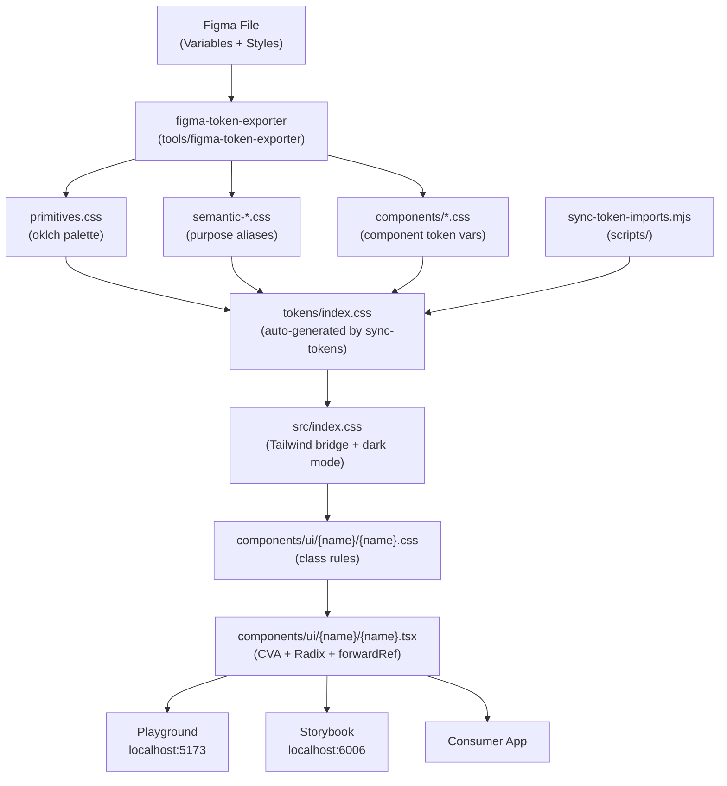
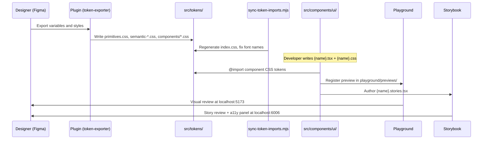

# System Overview — Sparks Design System (Radix UI)

Generated: 2026-05-20

---

## Business Context

### Business Description

Sparks Design System is a production-ready React component library that converts Figma designs into code with full token parity and full variant coverage. It serves as the single source of truth for UI components, design tokens, and visual language across products built on this system.

The library is built on Radix UI primitives (behaviour + accessibility), styled with Tailwind CSS v4 (layout utilities), and uses CSS custom properties for all visual tokens. The Figma file is the upstream source for all design decisions — tokens flow from Figma through an export plugin into CSS files that the codebase consumes directly.

### Business Transactions

| # | Transaction | Description |
|---|---|---|
| T1 | Export tokens from Figma | Designer exports variables/styles from Figma using the embedded figma-token-exporter plugin, producing CSS files in src/tokens/ |
| T2 | Sync token imports | `npm run sync-tokens` regenerates src/tokens/index.css to pick up newly exported files and corrects font-family names for variable fonts |
| T3 | Build a component | Developer implements a React component in src/components/ui/{name}/ using Radix primitives, CVA, and the exported component tokens |
| T4 | QA component in Playground during build | While building a component, the developer runs `npm run dev` and opens localhost:5173 to visually verify all variants, sizes, and states before the component is considered done — an internal build-time check, not end-use |
| T5 | Review component in Storybook | Developer runs `npm run storybook` and opens localhost:6006 to view stories, inspect controls, and check the accessibility panel |
| T6 | Run accessibility tests | `npm run test-storybook` runs axe-playwright against all stories headlessly and fails on any WCAG violation |
| T7 | Apply dark mode | Consumer sets `data-theme="dark"` on the `<html>` element; the token cascade switches all semantic colour tokens automatically |
| T8 | Consume a component | Consumer imports from the library (`import { Button } from "@/components/ui/button"`) and passes variant/size/state props |

### Business Dictionary

| Term | Definition |
|---|---|
| Primitive token | A raw oklch colour value with no semantic meaning (e.g. `--colors-steel-grey-500`). Never used directly in components. |
| Semantic token | A purpose-named alias pointing to a primitive (e.g. `--background-default → --colors-steel-grey-50`). Carries intent. |
| Component token | A component-scoped variable pointing to a semantic token (e.g. `--button-color-primary-background → --color-accent`). Consumed by class rules. |
| CSS class rule | A CSS class (e.g. `.button-primary`) that applies component tokens to visual properties. Defined in the component's .css file. |
| CVA variant | A TypeScript mapping from a variant prop value (e.g. `variant: "primary"`) to one or more CSS class names. |
| Effect style | A utility class (`.es-{name}`) generated from Figma effect styles that applies box-shadow, filter, or backdrop-filter. |
| Text style | A utility class (`.ts-{name}`) generated from Figma text styles that applies a complete typography composition. |
| Radix primitive | A headless, accessible React component from @radix-ui/react-* that provides behaviour and ARIA semantics. |
| asChild | A Radix Slot pattern that renders a component as its child element (e.g. a Button that renders as an `<a>`). |
| Five-story pattern | The required Storybook structure: Default, Variants, States, Sizes, AllVariants — one story per design QA axis. |
| AI-DLC Lite | The lightweight AI-driven development lifecycle workflow governing component work in this repo. |

---

## System Architecture

### Overview

```
+------------------------------------------------------------------------+
|                     SPARKS DESIGN SYSTEM                               |
|                                                                        |
|   FIGMA (source of truth)                                              |
|   Primitives -> Semantic Variables -> Component Variables              |
|        |                                                               |
|        | figma-token-exporter plugin (tools/)                         |
|        v                                                               |
|   src/tokens/                                                          |
|   primitives.css   semantic-*.css   components/*.css                  |
|        |                                                               |
|        | npm run sync-tokens (scripts/sync-token-imports.mjs)         |
|        v                                                               |
|   src/tokens/index.css  (auto-generated)                              |
|        |                                                               |
|        | @import in src/index.css                                      |
|        v                                                               |
|   src/components/ui/{name}/                                           |
|   {name}.tsx (CVA + Radix + React.forwardRef)                         |
|   {name}.css (class rules consuming component tokens)                 |
|        |                                                               |
|        +----> src/playground/  (localhost:5173 visual review)         |
|        |                                                               |
|        +----> src/components/ui/{name}/{name}.stories.tsx             |
|                   (localhost:6006 Storybook + a11y tests)             |
+------------------------------------------------------------------------+
```

### Architecture Diagram



### Component Descriptions

| Component | Type | Purpose | Key Dependency |
|---|---|---|---|
| src/tokens/ | Token layer | CSS custom property cascade — primitives → semantic → component | Figma token exporter |
| scripts/sync-token-imports.mjs | Build script | Regenerates src/tokens/index.css, corrects variable font names | Node.js ESM |
| tools/figma-token-exporter | Figma plugin | Exports Figma variables and text styles as CSS to src/tokens/ | Figma Plugin API |
| src/components/ui/ | UI component layer | React components built on Radix primitives, styled by tokens | Radix UI, CVA, Tailwind |
| src/playground/ | Dev review app | Vite SPA for quick visual review of all components and themes | Vite, React |
| .storybook/ | Documentation | Storybook config: a11y addon, pseudo-states, theme toggle | Storybook 10, axe |

### Data Flow — Component Build and Render



### Integration Points

| Integration | Direction | Protocol | Purpose |
|---|---|---|---|
| Figma (via plugin) | Figma → repo | Figma Plugin API + file write | Exports design tokens as CSS |
| @fontsource-variable/* | External → repo | npm package | Self-hosted variable fonts |
| Radix UI | External → code | npm package | Headless component primitives |
| lucide-react | External → code | npm package | SVG icon library |
| Storybook | Dev tool | localhost:6006 | Component docs and a11y testing |
| Playground | Dev tool | localhost:5173 | Quick visual review |

---

## Code Structure

### Build System

- **Type**: npm + Vite 7
- **Pre-hooks**: `sync-tokens` runs before `dev`, `build`, and `storybook` via `pre*` npm script hooks
- **TypeScript**: strict mode, `noEmit`, bundler module resolution, `@` alias to `./src`
- **Path alias**: `@/` resolves to `src/` across all TypeScript and CSS imports

### Directory Layout

```
sparks-design-system-radixui/
+-- src/
|   +-- components/
|   |   +-- ui/
|   |       +-- button/          button.tsx  button.css  button.stories.tsx  index.ts
|   |       +-- card/            card.tsx  card.css  card.stories.tsx  index.ts
|   |       +-- combobox/        combobox.tsx  combobox.stories.tsx  index.ts
|   |       +-- dropdown-menu/   dropdown-menu.tsx  dropdown-menu.css  dropdown-menu.stories.tsx  index.ts
|   +-- tokens/
|   |   +-- index.css            (auto-generated -- do not edit)
|   |   +-- primitives.css
|   |   +-- semantic-colours.css
|   |   +-- semantic-effects.css
|   |   +-- semantic-effect-styles.css
|   |   +-- semantic-spacing-&-sizing.css
|   |   +-- semantic-text-styles.css
|   |   +-- semantic-typography.css
|   |   +-- components/
|   |       +-- button.css
|   |       +-- card.css
|   |       +-- dropdown-menu.css
|   |       +-- text-input.css   (token file exists -- no component yet)
|   +-- lib/
|   |   +-- utils.ts             cn() helper (clsx + tailwind-merge)
|   +-- playground/
|   |   +-- index.tsx            Playground app shell (theme toggle, sidebar nav)
|   |   +-- playground.css
|   |   +-- components/          Section + Row layout helpers
|   |   +-- previews/            button.tsx  card.tsx  combobox.tsx  dropdown-menu.tsx
|   +-- index.css                Tailwind bridge + dark mode overrides
|   +-- App.tsx
|   +-- main.tsx
|   +-- vite-env.d.ts
+-- .storybook/
|   +-- main.ts                  Addons: docs, a11y, pseudo-states
|   +-- preview.ts               Theme toggle global, a11y manual:false
|   +-- test-runner.ts           axe-playwright config
+-- scripts/
|   +-- sync-token-imports.mjs   Generates tokens/index.css, fixes font names
+-- tools/
|   +-- figma-token-exporter/    Figma plugin source (code.ts, ui.html, config.ts)
+-- .aidlc-lite-rule-details/    AI-DLC Lite workflow rule files
+-- aidlc-docs/                  AI-DLC documentation artifacts
+-- vite.config.ts
+-- tsconfig.json / tsconfig.app.json / tsconfig.node.json
+-- eslint.config.js
+-- package.json
```

### Design Patterns

| Pattern | Location | Purpose |
|---|---|---|
| Three-tier token cascade | src/tokens/ | Primitives → Semantic → Component tokens; isolates Figma from component code |
| CVA (class-variance-authority) | Every component .tsx | Maps variant props to CSS class names; single source for variant logic |
| React.forwardRef | Every component .tsx | Enables ref forwarding; required for all components without exception |
| Compound component | card/, combobox/ | Groups related sub-parts (Card, CardHeader, CardContent etc.) under a shared namespace |
| asChild / Radix Slot | button/ | Polymorphic rendering — Button can render as `<a>` without losing accessibility |
| Effect style utilities | semantic-effect-styles.css | `.es-{name}` classes apply shadows/filters; never use box-shadow directly in component CSS |
| Text style utilities | semantic-text-styles.css | `.ts-{name}` classes apply full typography compositions |
| Dark mode via data attribute | src/index.css | `[data-theme="dark"]` overrides semantic colour tokens; zero component code changes |
| Five-story Storybook pattern | Every .stories.tsx | Default, Variants, States, Sizes, AllVariants — one axis per story |

### Critical Dependencies

| Dependency | Version | Role |
|---|---|---|
| react | ^19.2.0 | UI runtime |
| react-dom | ^19.2.0 | DOM renderer |
| @radix-ui/react-* | Various ^1-2.x | Headless primitives for all interactive components |
| tailwindcss | ^4.1.17 | Utility CSS for layout only (not colour) |
| @tailwindcss/vite | ^4.1.17 | Tailwind v4 Vite integration |
| class-variance-authority | ^0.7.1 | Variant-to-class mapping |
| clsx | ^2.1.1 | Conditional class names |
| tailwind-merge | ^3.4.0 | Deduplicates conflicting Tailwind classes |
| lucide-react | ^0.563.0 | SVG icon set |
| @fontsource-variable/inter | ^5.2.8 | Self-hosted Inter Variable font |
| vite | ^7.2.4 | Dev server and bundler |
| typescript | ~5.9.3 | Type system (strict mode) |
| storybook | ^10.3.5 | Component documentation and review |
| @storybook/addon-a11y | ^10.3.5 | axe-core integration in Storybook UI |
| storybook-addon-pseudo-states | ^10.3.5 | Forces CSS pseudo-states via class selectors |
| @storybook/test-runner | ^0.24.3 | Headless Playwright-based story test runner |
| axe-playwright | ^2.2.2 | Accessibility assertions in test-runner |

---

## Component Inventory

### UI Components

| Component | Folder | Status | Radix Primitive | Variants | Sizes | Notes |
|---|---|---|---|---|---|---|
| Button | src/components/ui/button/ | Complete | @radix-ui/react-slot (Slot) | primary, secondary, tertiary, utility, destructive | sm, md, lg | Supports leadingIcon, trailingIcon, loading, asChild |
| Card | src/components/ui/card/ | Complete | None (layout only) | default | — | Compound: Card, CardImage, CardContent, CardHeader, CardTitle, CardSubtitle, CardDescription, CardFooter |
| Combobox | src/components/ui/combobox/ | Partial | @radix-ui/react-popover | — | — | No dedicated .css file; complex open-state management via Popover.Anchor pattern |
| Dropdown Menu | src/components/ui/dropdown-menu/ | Complete | @radix-ui/react-dropdown-menu | — | — | Full Radix DropdownMenu wrapping with token-driven CSS |

### Token-Only Components (no React component yet)

| Token File | Path | Notes |
|---|---|---|
| text-input | src/tokens/components/text-input.css | Component tokens exported from Figma; React component not yet built |

### Playground Previews

| Preview | File | Components Shown |
|---|---|---|
| Button | src/playground/previews/button.tsx | All 5 variants, 3 sizes, disabled + loading states |
| Card | src/playground/previews/card.tsx | Card composite |
| Combobox | src/playground/previews/combobox.tsx | Combobox usage |
| Dropdown Menu | src/playground/previews/dropdown-menu.tsx | Dropdown usage |

---

## Technology Stack

### Languages and Runtimes

| Language | Version | Usage |
|---|---|---|
| TypeScript | ~5.9.3 | All source code; strict mode enabled |
| JavaScript (ESM) | ES2020 | Build scripts (sync-token-imports.mjs, eslint.config.js) |
| CSS | Custom Properties + Tailwind v4 | All styling |

### Frameworks and Libraries

| Framework | Version | Purpose |
|---|---|---|
| React | ^19.2.0 | Component runtime |
| Radix UI | ^1-2.x | Headless accessible component primitives |
| Tailwind CSS | ^4.1.17 | Layout utility classes (not colour) |
| CVA | ^0.7.1 | Variant management |
| Storybook | ^10.3.5 | Component docs and testing environment |
| Vite | ^7.2.4 | Dev server, bundler, HMR |

### Build and Dev Tools

| Tool | Version | Purpose |
|---|---|---|
| Vite | ^7.2.4 | Dev server (port 5173), production bundler |
| TypeScript compiler | ~5.9.3 | Type checking (`npm run typecheck`) |
| ESLint | ^9.39.1 | Linting — TypeScript, React hooks, react-refresh |
| Storybook | ^10.3.5 | Story runner (port 6006) |

### Testing Tools

| Tool | Version | Purpose |
|---|---|---|
| @storybook/addon-a11y | ^10.3.5 | In-browser axe-core accessibility panel |
| @storybook/test-runner | ^0.24.3 | Headless Playwright story runner |
| axe-playwright | ^2.2.2 | WCAG violation assertions in test-runner |
| storybook-addon-pseudo-states | ^10.3.5 | Forces :hover/:active/:focus-visible via class selectors |

### Font Infrastructure

| Package | Figma Name | CSS Name |
|---|---|---|
| @fontsource-variable/inter | "Inter" | "Inter Variable" |
| (mapped) | "Playfair Display" | "Playfair Display Variable" |
| (mapped) | "Roboto Mono" | "Roboto Mono Variable" |
